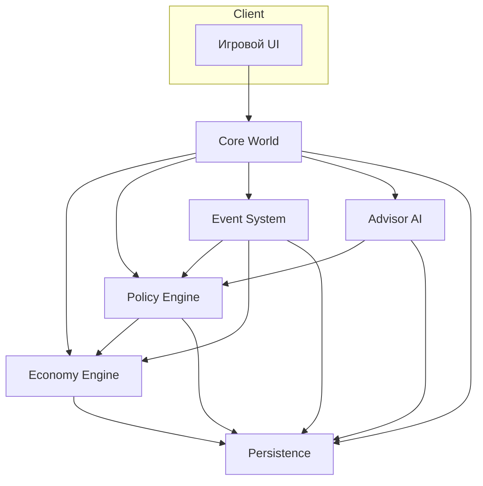

# Архитектурный документ (версия 0.1)

## 1. Модульная диаграмма


## 2. Структура состояния и цикл обновления
### 2.1 Дерево состояния
```
GameState
├── Meta
│   ├── tick (int)
│   └── calendar (год, квартал)
├── World
│   ├── regions[] (экономика, население, лояльность, модификаторы)
│   ├── estates[] (влияние, удовлетворенность, требования)
│   ├── factions[] (дипломатические отношения, договоры)
│   └── projects[] (тип, прогресс, сроки)
├── Economy
│   ├── resources {gold, influence, manpower}
│   ├── budgets {экономика, дипломатия, внутренняя политика, военное, наука}
│   └── indicators {stability, legitimacy, innovation, unrest}
├── Policy
│   ├── active_policies[] (название, параметры, сроки)
│   ├── decrees_queue[] (ожидающие указания игрока)
│   ├── reforms[] (статус, эффекты, доверие сословий)
│   └── advisor_assignments[] (id советника, ведомство, доверие)
├── Advisors
│   ├── roster[] (характеристики, отношения с сословиями)
│   ├── trust_levels {player↔advisor}
│   └── reports_history[]
├── Events
│   ├── timeline[] (плановые события)
│   ├── active_events[] (влияния в текущем тике)
│   └── triggers[] (условия запуска)
└── Persistence
    ├── save_slots[]
    └── analytics (метаданные кампаний)
```

### 2.2 Поток обновления за тик (квартал)
1. **Ввод игрока**: выбор указов, ответов на события, перераспределение ресурсов.
2. **Policy Engine**: валидирует новые решения, обновляет очередь реформ, рассчитывает стоимость и политические последствия.
3. **Advisor AI**: обрабатывает отчёты и рекомендации, обновляет доверие и готовит обратную связь игроку.
4. **Event System**: вычисляет наступление плановых событий, проверяет триггеры случайных, формирует эффекты.
5. **Economy Engine**: применяет эффекты политики и событий к ресурсам, бюджетам, индикаторам и регионам.
6. **Core World**: синхронизирует изменения мировых сущностей, обновляет проекты и состояние регионов, собирает итоговые метрики.
7. **Persistence**: при необходимости сохраняет слепок состояния, журналирует тик и аналитические данные.
8. **UI обновление**: публикует в клиент новые значения метрик, отчёты и уведомления.

## 3. Контракт игрок–советники
### 3.1 Формат указов (player → advisors)
- `Decree`: `{id, issued_at_tick, target_department, intent, parameters, priority}`
- Декреты передаются через Policy Engine и становятся доступными советнику ведомства.

### 3.2 Формат отчётов (advisors → player)
- `AdvisorReport`: `{advisor_id, department, summary_text, metrics_delta, risks[], recommendations[]}`
- Каждый отчёт включает краткую оценку хода, количественные изменения и список предупреждений.

### 3.3 Уровни доверия
- Шкала `0.0 – 1.0`, агрегируется как `TrustMatrix[player↔advisor]`.
- Источники изменения: выполнение рекомендаций, исход событий, конфликт указов.
- Пороговые состояния:
  - `<0.3`: советник может скрывать часть данных, инициировать собственные события риска.
  - `0.3–0.7`: стандартный обмен информацией.
  - `>0.7`: открывает дополнительные инсайты, временные бонусы эффективности.
- Интерфейс: `updateTrust(advisorId, delta, reason)` вызывается Policy Engine после каждого тика.

### 3.4 Сценарий консультаций совета
- По завершении квартала формируется `EventDecisionContext`, который используется модулем `generateAdvisorConsultations` для сбора обратной связи.
- Поддерживаются три типа запросов:
  1. **KPI-запрос** — анализирует текущий KPI с наибольшим риском, формирует оценки и рекомендации профильных советников.
  2. **Событийный запрос** — выбирает приоритетное событие квартала, фиксирует аргументацию и предложенные действия.
  3. **Ведомственный запрос** — подсвечивает ведомство с минимальной эффективностью и собирает план стабилизации.
- Результат сериализуется как `AdvisorConsultationThread` и включается в `QuarterlyReport` вместе с резюме и итоговыми рекомендациями.
- UI получает агрегированные выводы (статус, списки аргументов, команду для «Передать исполнение») и отображает их рядом с KPI и событиями.

## 4. Потоки исполнения
- **Основной поток (UI/Main Thread)**:
  - Рендеринг интерфейса и визуальных эффектов.
  - Обработка вводов игрока, формирование пакетов `Decree`.
  - Менеджер состояний, который подписывается на результаты симуляции.
- **Web Worker / WebAssembly**:
  - Economy Engine (расчёты ресурсов, бюджетов, прогнозов).
  - Event System (обработка триггеров, генерация эффектов).
  - Advisor AI (модели принятия решений, генерация отчётов).
  - Policy Engine (валидация и симуляция исходов).
  - Core World (агрегация мировых данных, расчёт проектов) — исполняется в wasm для производительности.
  - Persistence Worker (сериализация состояния, подготовка сохранений) — асинхронно, чтобы не блокировать UI.

## 5. Интерфейсы между подсистемами
| Отправитель | Получатель | Тип интерфейса | Сообщение/данные |
|-------------|------------|----------------|------------------|
| UI | Policy Engine | `postMessage` (main → worker) | Пакеты `Decree`, взаимодействия событий |
| Policy Engine | Advisor AI | wasm вызов `evaluateDecision(decree)` | Просчёт реакции советника |
| Advisor AI | Policy Engine | wasm callback `advisorResponse` | Отчёт, изменения доверия |
| Policy Engine | Economy Engine | wasm вызов `applyPolicies(stateSlice)` | Изменения в бюджетах и реформах |
| Event System | Economy Engine | очередь событий | Эффекты, влияющие на ресурсы |
| Economy Engine | Core World | разделяемая память `SharedArrayBuffer` | Обновлённые метрики регионов |
| Core World | Persistence | worker сообщение `snapshotState` | Серилизованное состояние тика |
| Persistence | UI | main-thread async `saveComplete` | Подтверждение сохранения, обновление списка |
| Event System | UI | main-thread `dispatchEventNotice` | Уведомления и описания событий |
| Core World | UI | main-thread `stateUpdate` | Актуальные данные для отображения |

## 6. Требования к синхронизации
- Общий tick инициируется основным потоком, который отправляет сигнал `startTick` в wasm-пайплайн.
- Между подсистемами используется `SharedArrayBuffer` и атомики для состояния ресурсов и метрик.
- UI подписан на событие `tickComplete` от Persistence Worker для безопасного обновления визуализации.

## 7. Расширяемость
- Новые подсистемы подключаются через очереди сообщений или wasm-интерфейсы.
- Все форматы данных описываются в JSON Schema в будущих ревизиях.

